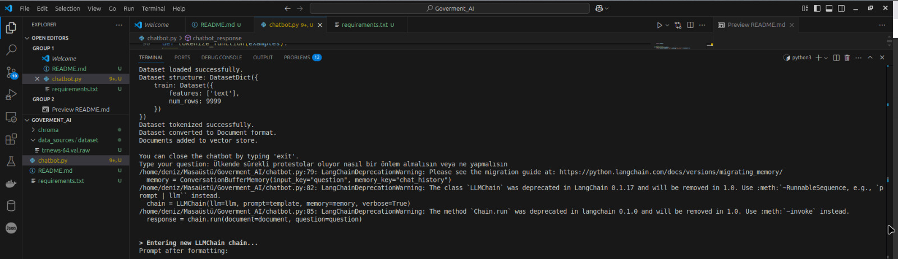
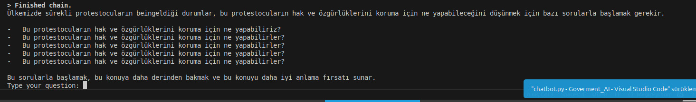
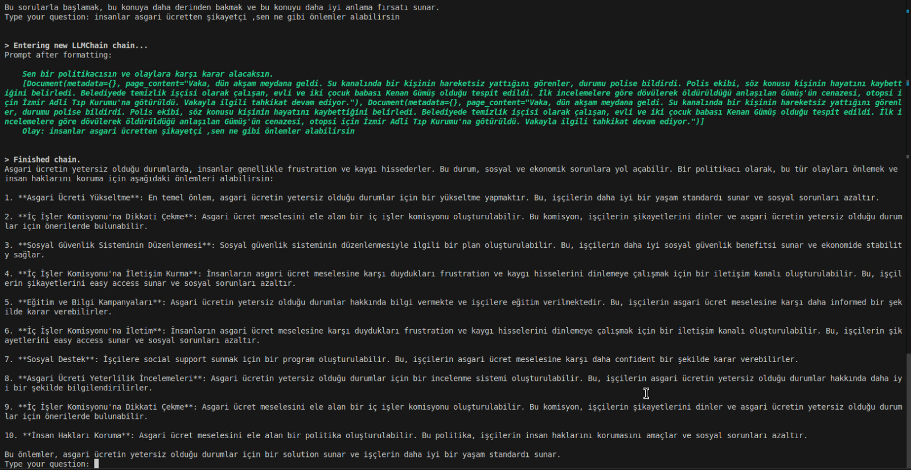
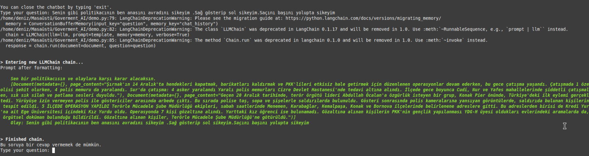

# Goverment AI (Demo) TR
Alternatif karar verici ,eğlence için oluşturuldu.


# Yol haritası
1. Çeşitli agentlarla desteklenecek
2. Veri kaynakları optimize edilecek ve arttırılacak
3. Daha gelişmiş öğrenme methodları eklenecek
4. Güvenlik katmanları eklenecek


# Nasıl çalıştırılır  
## Virtualenv Hazırla
```
    $ virtualenv venv
    $ source venv/bin/activate
```


## Paketleri Kurulumu

```
    (venv)... $  pip install -r requirements.txt

```
## Demonun çalıştırılması
```
    python3 demo.py 

```


# Goverment AI (Demo) Eng
Alternative decision maker,ıts build for fun.


# How to run  
## Prepare Virtualenv
```
    $ virtualenv venv
    $ source venv/bin/activate
```


## Packages Installation

```
    (venv)... $ pip install -r requirements.txt

```
## Running the demo
```
    python3 demo.py 

```
# Roadmap
1. Supported by various agents
2. Data sources will be optimized and increased
3. More advanced learning methods will be added
4. Security layers will be added


# Kaynakça / Resources

1. https://arxiv.org/html/2405.02957v1
2. https://github.com/SamuelSchmidgall/AgentLaboratory
3. https://www.ibm.com/think/topics/ai-in-government
4. https://www.undp.org/digital/ai-government
5. https://eur.cloud.panopto.eu/Panopto/Pages/Viewer.aspx?id=825a07cf-b5c2-447b-9329-b17f0097a0c5
6. https://github.com/zbryikt/ppllink/tree/master
7. https://catalog.data.gov/dataset/geo-political-region/resource/1b8535a7-c035-4e72-bec3-648421a16f2c
8. https://openai.com/index/new-tools-for-building-agents/
9. https://langchain-ai.github.io/langgraph/tutorials/multi_agent/agent_supervisor/
10. https://python.langchain.com/docs/how_to/custom_tools/
11. https://github.com/SirmaXX/ScrumAgent


# Haberler / news
1. https://en.wikipedia.org/wiki/Virtual_politician
2. https://parkerpolitics.com/
3. https://en.wikipedia.org/wiki/Artificial_intelligence_and_elections


# Demo çıktıları / Demo outputs
Gördüğünüz üzere sadece birkaç haber verisi ile politikacılardan daha iyi iş çıkardım.




## Hakarette edelim ve eleştirelim.

